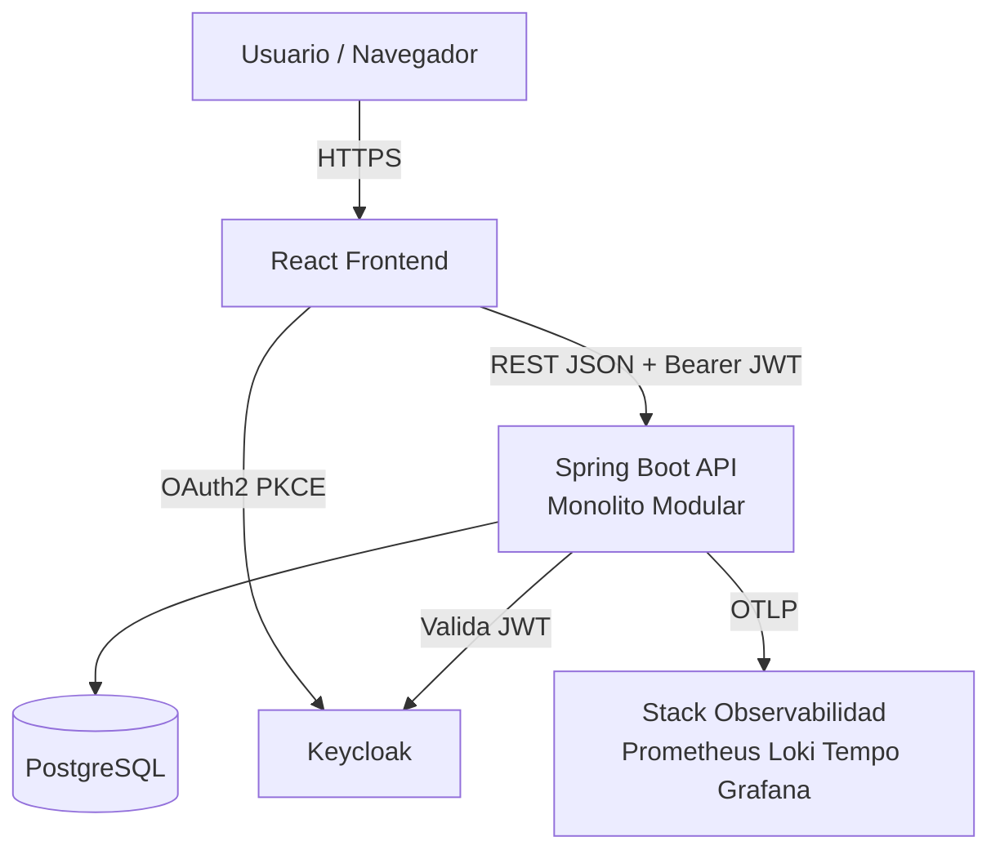
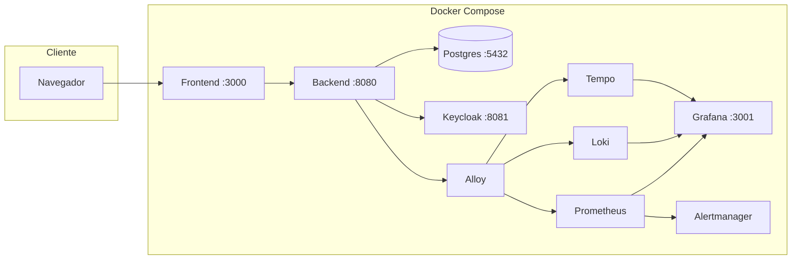
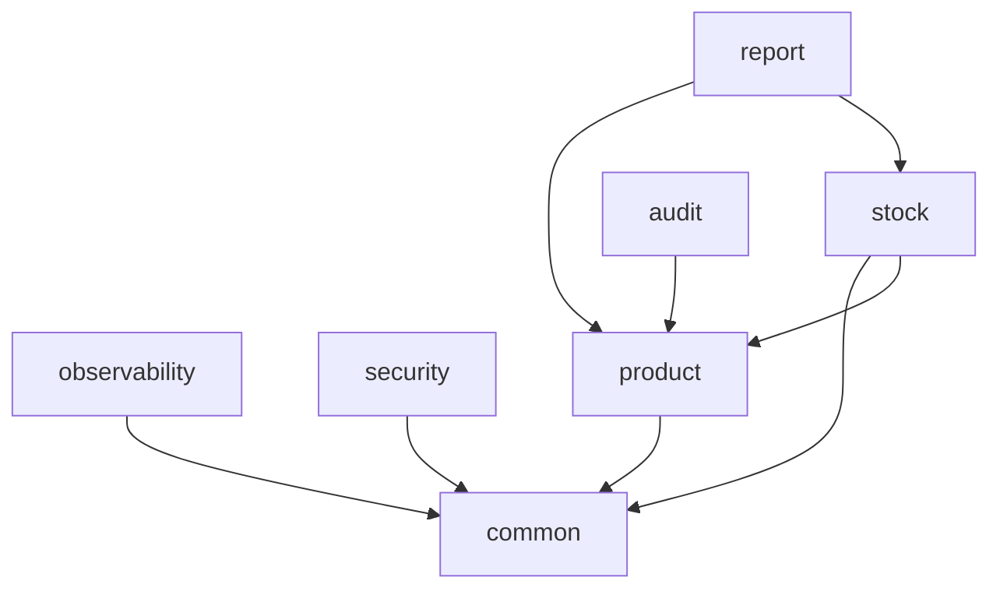

# Arquitectura del sistema — Monolito modular empresarial

Este documento describe la arquitectura lógica y física del Sistema de Gestión de Inventarios, las decisiones técnicas y los principios que garantizan calidad de ingeniería.

---

## 1. Decisiones arquitectónicas (ADR resumidas)

### ADR-001: Monolito modular (no microservicios)

| Aspecto | Decisión |
|---------|----------|
| **Contexto** | Proyecto académico con plazo limitado y requisitos de testing/observabilidad |
| **Opciones** | Microservicios, monolito simple, monolito modular |
| **Decisión** | **Monolito modular** — una aplicación Spring Boot desplegable |
| **Razones** | Menor complejidad operativa; testing directo; un solo despliegue; separación interna por dominios |
| **Consecuencias** | Disciplina en paquetes; evitar acoplamiento circular entre módulos |

### ADR-002: PostgreSQL en Docker (no Supabase como backend principal)

| Criterio | PostgreSQL local | Supabase |
|----------|------------------|----------|
| Keycloak | Compatible como BD del dominio | Supabase Auth conflictúa con arquitectura |
| Testcontainers | Nativo | Difícil de replicar |
| Flyway | Control total | Menos transparente en demo |
| Observabilidad | Métricas de pool y contenedor | Infra externa opaca |

**Decisión:** PostgreSQL en Docker para dev/staging. Supabase solo como opción futura de hosting administrado, **sin** Supabase Auth.

### ADR-003: Keycloak como único IdP

El backend es **OAuth2 Resource Server**: no almacena contraseñas. Valida JWT emitidos por Keycloak.

### ADR-004: Permisos granulares (authorities)

No basta con rol `ADMIN` / `USER`. Cada operación exige authority (`product:manage`, `stock:view`, etc.).

---

## 2. Vista de contexto (C4 — nivel 1)



---

## 3. Vista de contenedores (C4 — nivel 2)



---

## 4. Arquitectura lógica por capas

| Capa | Responsabilidad | Tecnología |
|------|-----------------|------------|
| Presentación | UI, routing, guards, llamadas API | React + Vite + TS |
| API / adaptadores | REST, validación entrada, seguridad método | Spring `@RestController` |
| Dominio / aplicación | Reglas de negocio, transacciones | `@Service` |
| Persistencia | Acceso a datos, queries | Spring Data JPA |
| Infraestructura cross-cutting | Seguridad JWT, logs, correlationId, excepciones | Módulos security, observability, common |
| Identidad | Login, tokens, roles, permisos | Keycloak |
| Datos | Esquema versionado, auditoría | PostgreSQL + Flyway + Envers |

### Flujo de una petición autenticada

```
1. Usuario inicia sesión en Keycloak (Authorization Code + PKCE)
2. Frontend almacena access_token (memoria / storage seguro)
3. Request API incluye Header: Authorization: Bearer <JWT>
4. Spring Security valida firma JWT (JWKS URI)
5. JwtAuthenticationConverter extrae authorities (product:view, ...)
6. @PreAuthorize evalúa permiso del método
7. Controller delega a Service
8. Service ejecuta lógica + @Transactional
9. Repository persiste en PostgreSQL
10. CorrelationIdFilter + OTel registran log/traza/métrica
11. Response DTO serializado a JSON
```

---

## 5. Módulos del backend

Paquete base: `com.company.inventory`

```
com.company.inventory
├── InventoryApplication.java
├── product/          # Catálogo y CRUD
├── stock/            # Movimientos y existencias
├── report/           # Dashboard y métricas
├── audit/            # Consulta Envers
├── security/         # SecurityConfig, JWT converter
├── observability/    # CorrelationId, logging
└── common/           # Excepciones, respuestas API, validación
```

### Responsabilidades por módulo

| Módulo | Controller | Service | Repository | Permisos |
|--------|------------|---------|------------|----------|
| product | ProductController | ProductService | ProductRepository | product:view, product:manage |
| stock | StockController | StockService | StockMovementRepository | stock:view, stock:manage |
| report | ReportController | ReportService | — (queries) | report:view |
| audit | AuditController | AuditService | Envers API | audit:view |
| security | — | — | — | Config global |
| observability | — | Filters, config | — | — |
| common | — | — | — | ErrorHandler, ApiResponse |

### Reglas internas (obligatorias)

1. **Controllers** solo orquestan: validan permisos, mapean DTOs, delegan.
2. **Services** contienen reglas de negocio y transacciones.
3. **Repositories** no devuelven entidades al frontend (solo al service).
4. **DTOs** separan contrato HTTP del modelo JPA.
5. **Ningún módulo** accede al repository de otro módulo sin pasar por service público (evitar acoplamiento).
6. **Excepciones de dominio** se traducen en `common` a respuestas HTTP estándar.

---

## 6. Arquitectura del frontend

```
frontend/src/
├── components/
│   ├── layout/AppShell.tsx
│   ├── auth/ProtectedRoute.tsx
│   ├── auth/PermissionGate.tsx
│   └── ui/                  # shadcn
├── pages/
│   ├── Login.tsx
│   ├── Dashboard.tsx
│   ├── Products.tsx
│   ├── StockMovements.tsx
│   ├── Reports.tsx
│   └── Audit.tsx
├── hooks/
│   └── useAuth.ts
├── lib/
│   ├── api.ts               # Cliente HTTP + interceptors
│   └── keycloak.ts
└── routes/
    └── index.tsx
```

**Patrones:**

- **Smart vs presentational:** páginas cargan datos; componentes UI son dumb cuando sea posible.
- **PermissionGate:** render condicional por authority del token.
- **Error boundary / estados:** loading, empty, error en cada vista de lista.

---

## 7. Modelo de despliegue por ambiente

| Ambiente | Compose file | Servicios |
|----------|--------------|-----------|
| Development | `docker-compose.dev.yml` | postgres, keycloak, backend, frontend |
| Staging | `docker-compose.staging.yml` | Todos + observabilidad + Jenkins + SonarQube |
| Test (CI) | `docker-compose.test.yml` | postgres, keycloak (Testcontainers alternativo) |

Ver [deployment-guide.md](./deployment-guide.md).

---

## 8. Integración de observabilidad

```
Spring Boot (Micrometer + OTel SDK)
        │ OTLP
        ▼
     Alloy (collector)
    ┌───┼───┐
    ▼   ▼   ▼
  Prom Loki Tempo
    └───┬───┘
        ▼
     Grafana ──► Alertmanager
```

Detalle en [observability-guide.md](./observability-guide.md).

---

## 9. CI/CD en la arquitectura

| Pipeline | Trigger | Propósito |
|----------|---------|-----------|
| GitHub Actions | PR / push | Feedback rápido: build, unit, lint, dependency scan |
| Jenkins | merge a main / manual | Entrega completa: integration, API, E2E, ZAP, Sonar, deploy staging |
| Nightly (opcional) | cron | ZAP, k6 smoke, dependency check |

Ver [cicd-and-quality.md](./cicd-and-quality.md).

---

## 10. Calidad arquitectónica — métricas de revisión

En cada Pull Request verificar:

- [ ] ¿El cambio respeta límites de módulo?
- [ ] ¿Hay DTO nuevo si cambia contrato API?
- [ ] ¿Flyway migration si cambia esquema?
- [ ] ¿Endpoint protegido con permiso correcto?
- [ ] ¿Prueba unitaria o integration para regla nueva?
- [ ] ¿Log incluye correlationId en flujo nuevo?

---

## 11. Diagrama de módulos de negocio (dependencias permitidas)



`stock` puede depender de `product` (servicio de producto), pero **no** al revés. `report` agrega datos de product y stock.

---

## 12. Referencias cruzadas

- [data-model.md](./data-model.md) — tablas y migraciones
- [api-contract.md](./api-contract.md) — REST y errores
- [security-model.md](./security-model.md) — Keycloak y matriz de acceso
- [development-guide.md](./development-guide.md) — estándares de código

---

*Arquitectura alineada con Plan QAS v3.0 — Monolito modular empresarial.*
