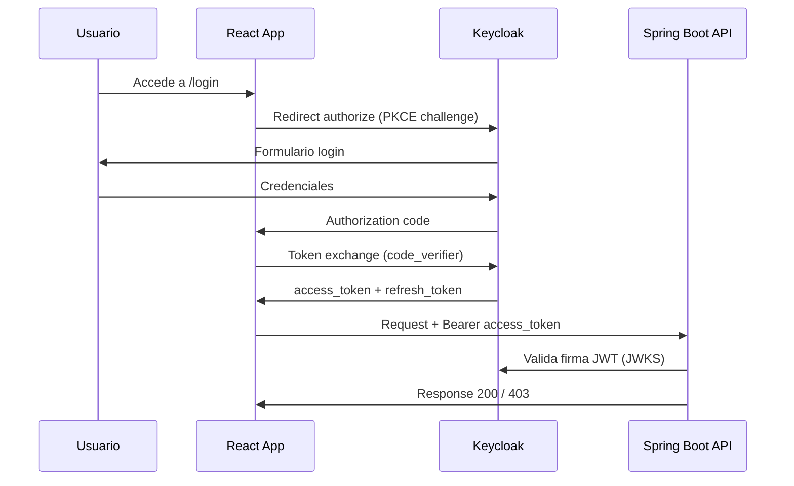

# Modelo de seguridad — Keycloak, OAuth2, JWT y permisos granulares

La seguridad es un pilar de defensa del proyecto. **No se protegen endpoints solo por nombre de rol**; cada operación exige una **authority** específica derivada de Keycloak.

---

## 1. Principios de seguridad

| Principio | Implementación |
|-----------|----------------|
| Zero trust en API | Todo `/api/v1/**` requiere JWT válido salvo health público |
| Least privilege | Roles compuestos con mínimo de permisos necesarios |
| No passwords en backend | Resource Server únicamente |
| Fail secure | Token inválido → 401; sin permiso → 403 |
| Reproducibilidad | `keycloak/realm-export.json` versionado |
| CORS restrictivo | Solo orígenes del frontend configurados |
| Sin secretos en Git | Client secrets y admin passwords en `.env` |

---

## 2. Flujo de autenticación (Authorization Code + PKCE)



### Configuración frontend

- Client: `inventory-frontend` (**public**)
- Flow: Standard flow + PKCE (S256)
- Redirect URI: `http://localhost:3000/*` (dev)

### Configuración backend

- Client: `inventory-api` (audience / resource)
- Spring: `spring.security.oauth2.resourceserver.jwt.issuer-uri`

---

## 3. Realm y clientes Keycloak

| Elemento | Valor |
|----------|-------|
| Realm | `inventory-realm` |
| Client frontend | `inventory-frontend` (public, PKCE) |
| Client API | `inventory-api` (validación de audience opcional) |
| Export | `keycloak/realm-export.json` |

### Importar realm en Docker

```yaml
keycloak:
  volumes:
    - ./keycloak/realm-export.json:/opt/keycloak/data/import/realm-export.json
  environment:
    KC_IMPORT: /opt/keycloak/data/import/realm-export.json
```

---

## 4. Permisos (authorities)

| Permiso | Descripción |
|---------|-------------|
| `product:view` | Listar y ver detalle de productos |
| `product:manage` | Crear, editar, inactivar productos |
| `stock:view` | Ver existencias e historial |
| `stock:manage` | Registrar entradas, salidas, ajustes |
| `report:view` | Dashboard y reportes |
| `audit:view` | Consultar auditoría Envers |
| `user:manage` | Gestión usuarios/roles en Keycloak (admin) |

### Implementación en Keycloak

Crear como **Client Roles** del client `inventory-api` (o realm roles según diseño del equipo):

1. Clients → `inventory-api` → Roles → crear cada permiso
2. Roles compuestos (realm o client) agrupan permisos
3. Asignar roles a usuarios de prueba

---

## 5. Roles de negocio y matriz de permisos

| Rol | Permisos |
|-----|----------|
| **Admin** | Todos |
| **Warehouse Manager** | product:view, product:manage, stock:view, stock:manage, report:view |
| **Inventory Clerk** | product:view, stock:view, stock:manage |
| **Viewer / Auditor** | product:view, stock:view, report:view, audit:view |
| **Employee Basic** | product:view, stock:view |

### Matriz rol × endpoint (extracto)

| Endpoint | Admin | Wh. Manager | Inv. Clerk | Viewer | Employee |
|----------|-------|-------------|------------|--------|----------|
| GET /products | ✓ | ✓ | ✓ | ✓ | ✓ |
| POST /products | ✓ | ✓ | ✗ | ✗ | ✗ |
| POST /stock/movements | ✓ | ✓ | ✓ | ✗ | ✗ |
| GET /audit | ✓ | ✗ | ✗ | ✓ | ✗ |
| GET /reports/dashboard | ✓ | ✓ | ✗ | ✓ | ✗ |

---

## 6. Protección en Spring Boot

### SecurityConfig (esqueleto)

```java
@Configuration
@EnableWebSecurity
@EnableMethodSecurity
public class SecurityConfig {

    @Bean
    SecurityFilterChain filterChain(HttpSecurity http) throws Exception {
        http
            .csrf(csrf -> csrf.disable())
            .cors(Customizer.withDefaults())
            .authorizeHttpRequests(auth -> auth
                .requestMatchers("/actuator/health").permitAll()
                .requestMatchers("/api/v1/**").authenticated()
                .anyRequest().authenticated())
            .oauth2ResourceServer(oauth2 -> oauth2
                .jwt(jwt -> jwt.jwtAuthenticationConverter(jwtAuthenticationConverter())));
        return http.build();
    }
}
```

### Ejemplo @PreAuthorize

```java
@PreAuthorize("hasAuthority('product:manage')")
@PostMapping
public ResponseEntity<ProductResponse> create(@Valid @RequestBody ProductRequest request) {
    return ResponseEntity.status(HttpStatus.CREATED).body(productService.create(request));
}
```

### JwtAuthenticationConverter

Mapear `resource_access.inventory-api.roles` o `realm_access.roles` a `GrantedAuthority` **sin** prefijo `ROLE_` si se usa `hasAuthority`:

```java
// Ejemplo: extraer roles del client inventory-api
Collection<GrantedAuthority> authorities = roles.stream()
    .map(SimpleGrantedAuthority::new)
    .collect(Collectors.toList());
```

**Punto crítico de defensa:** demostrar en vivo que un Inventory Clerk recibe **403** al intentar `POST /products`.

---

## 7. Authorization Services (opcional avanzado)

Para defensa técnica reforzada:

| Elemento | Ejemplos |
|----------|----------|
| Resources | products, stock, reports, audit, users |
| Scopes | view, manage |
| Policies | Admin Policy, Warehouse Manager Policy |
| Permissions | product:view = resource products + scope view + policy |

---

## 8. Frontend — guards y UI

### ProtectedRoute

```typescript
// Pseudocódigo
if (!keycloak.authenticated) return <Navigate to="/login" />;
if (requiredPermission && !hasPermission(requiredPermission)) {
  return <ForbiddenPage />;
}
return <Outlet />;
```

### PermissionGate

```tsx
<PermissionGate permission="product:manage">
  <Button onClick={onCreate}>Nuevo producto</Button>
</PermissionGate>
```

### Interceptor HTTP

```typescript
api.interceptors.request.use((config) => {
  const token = keycloak.token;
  if (token) config.headers.Authorization = `Bearer ${token}`;
  return config;
});
```

### Manejo de errores

| Código | Acción UI |
|--------|-----------|
| 401 | Redirigir a login / refrescar token |
| 403 | Toast o página "Sin permisos" |

---

## 9. Usuarios de prueba (documentar en README)

| Usuario | Rol | Password (dev) | Uso en pruebas |
|---------|-----|----------------|----------------|
| admin@test.com | Admin | (definir en realm) | Acceso total |
| warehouse.manager@test.com | Warehouse Manager | — | CRUD operativo |
| clerk@test.com | Inventory Clerk | — | Solo stock |
| viewer@test.com | Viewer / Auditor | — | Solo lectura + audit |
| employee@test.com | Employee Basic | — | Lectura mínima |

> Usar contraseñas solo en entornos locales; nunca commitear.

---

## 10. CORS

```java
@Bean
CorsConfigurationSource corsConfigurationSource() {
    CorsConfiguration config = new CorsConfiguration();
    config.setAllowedOrigins(List.of("http://localhost:3000"));
    config.setAllowedMethods(List.of("GET", "POST", "PUT", "DELETE", "PATCH", "OPTIONS"));
    config.setAllowedHeaders(List.of("*"));
    config.setAllowCredentials(true);
    // ...
}
```

En staging: actualizar orígenes al dominio real del frontend.

---

## 11. Pruebas de seguridad obligatorias

| Caso | Herramienta | Resultado |
|------|-------------|-----------|
| Sin Authorization header | RestAssured | 401 |
| Token expirado / malformado | RestAssured | 401 |
| Rol sin permiso | RestAssured + IT | 403 |
| Rol con permiso | RestAssured | 2xx |
| UI oculta botones | Playwright | Elemento no visible |
| JWT en Swagger | Manual | Authorize → Try it out |
| ZAP baseline | OWASP ZAP | Reporte archivado |
| Dependencias vulnerables | Dependency Check | 0 críticas en gate |

---

## 12. Checklist de configuración Keycloak

- [ ] Realm `inventory-realm` creado
- [ ] Client `inventory-frontend` con PKCE
- [ ] Client `inventory-api` configurado
- [ ] 7 permisos creados como roles
- [ ] 5 roles de negocio compuestos
- [ ] 5 usuarios de prueba asignados
- [ ] Realm exportado a JSON
- [ ] Issuer URI coincide con `application.yml`
- [ ] Refresh token y SSO session configurados
- [ ] Pruebas 401/403 documentadas en qa-evidence

---

## 13. Referencias

- [api-contract.md](./api-contract.md)
- [testing-guide.md](./testing-guide.md) — PermissionApiTest
- [deployment-guide.md](./deployment-guide.md) — variables KEYCLOAK_*
