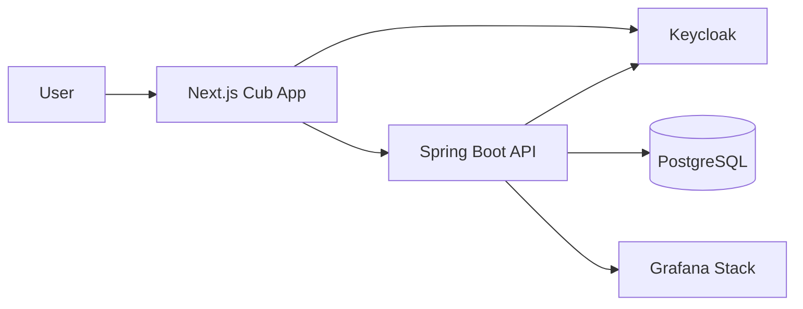
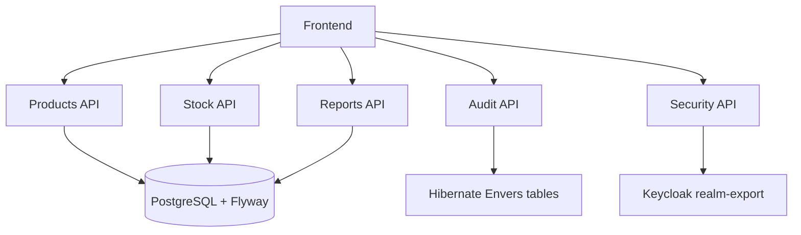
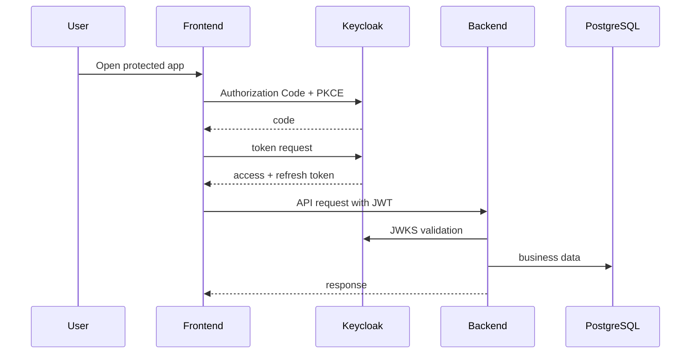
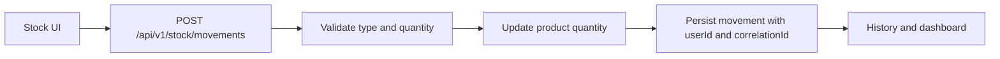
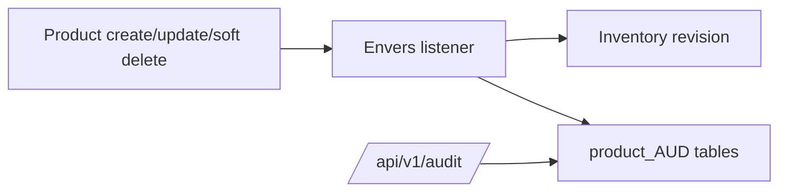
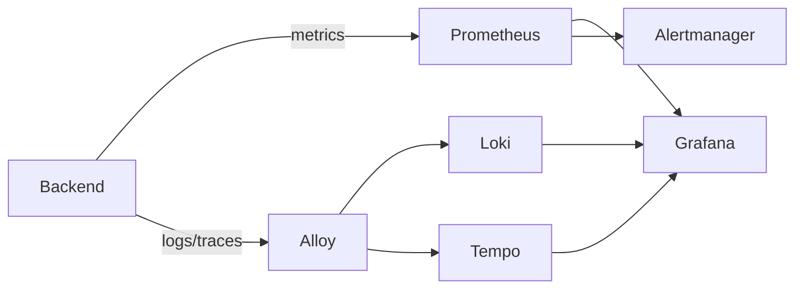
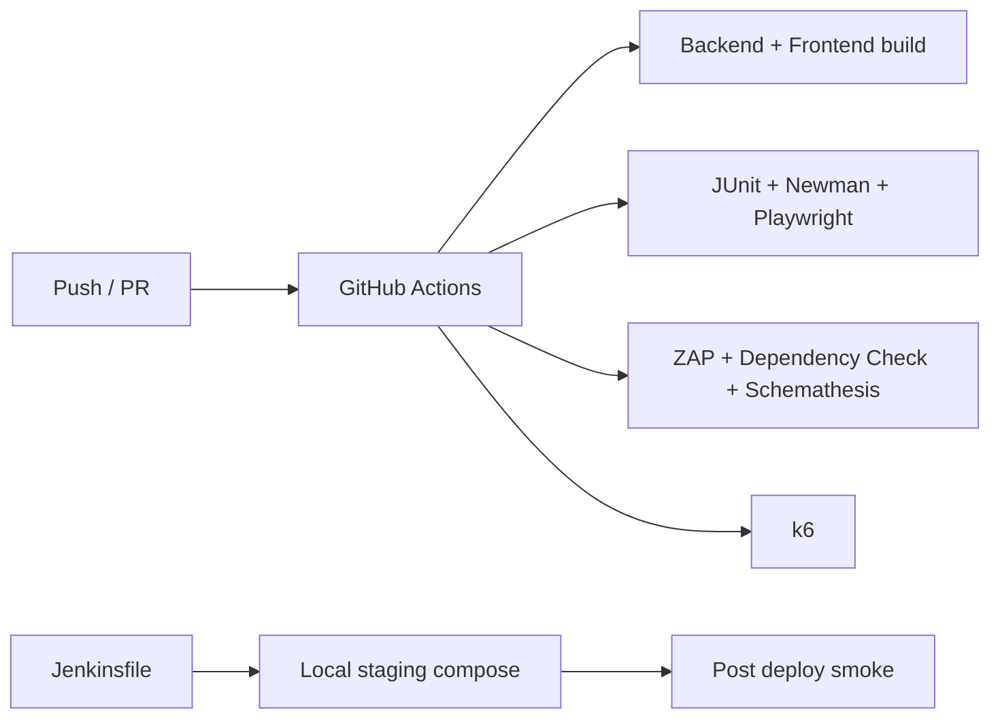

# Architecture - Cub Inventory QAS

## Summary

Cub uses a Spring Boot API, Next.js frontend, PostgreSQL persistence, Keycloak identity provider and a Grafana observability stack. The architecture is containerized with Docker Compose for dev, staging, observability and local production.

## Stack

Backend: Spring Boot 3.4, Java 21, Maven, PostgreSQL, Flyway, Hibernate Envers, Micrometer, OpenTelemetry.

Frontend: Next.js 15, React 19, TypeScript, Axios, App Router.

Security: Keycloak 26, OAuth2 Authorization Code + PKCE, JWT resource server, authorities.

Observability: Prometheus, Loki, Tempo, Alloy, Grafana, Alertmanager.

Testing: JUnit, Mockito, Testcontainers, Newman, Playwright, ZAP, Dependency Check, Schemathesis, k6.

## C4 Level 1

## C4 Level 2

## Authentication Flow

## Stock Movement Flow

## Envers Audit Flow

## Observability Flow

## CI/CD Flow

## Services and Ports

| Service | Port | Notes |
|---|---:|---|
| Frontend | 3000 | Next.js app |
| Backend | 8080 | API, Swagger, Actuator |
| Keycloak | 8081 | Public IdP URL |
| PostgreSQL | 5432 | Dev only exposed |
| Grafana | 3030 | Dashboards |
| Prometheus | 9090 | Metrics |
| Loki | 3100 | Logs |
| Tempo | 3200 | Traces |
| Alertmanager | 9093 | Alerts |

## Main Environment Variables

`DATABASE_URL`, `DATABASE_USERNAME`, `DATABASE_PASSWORD`, `KEYCLOAK_ISSUER_URI`, `KEYCLOAK_JWKS_URI`, `NEXT_PUBLIC_KEYCLOAK_URL`, `NEXT_PUBLIC_APP_URL`, `INVENTORY_CORS_ORIGINS`, `OTEL_EXPORTER_OTLP_*`.

## Decisions

| ADR | Decision |
|---|---|
| ADR-01 | Spring Boot + PostgreSQL for transactional inventory |
| ADR-02 | Keycloak + PKCE for enterprise auth |
| ADR-03 | Authorization by authority, not role name |
| ADR-04 | Soft delete + Envers for traceability |
| ADR-05 | Testcontainers for integration database tests |
| ADR-06 | OpenTelemetry stack for metrics, logs and traces |
| ADR-07 | Docker Compose for dev, staging and local production |

## Known Limitations

Local production is demonstrable, not cloud-hardened. PostgreSQL exporter is not included, so database infrastructure alerts are documented as a limitation. k6 and security scans can be heavy and may run manually in CI.

## Basic Maintenance

Run Flyway validation after migrations, keep Keycloak realm export versioned, update `.env.example` for new variables, and archive QA evidence under `docs/qa-evidence/`.
