# Architecture - Cub Inventory QAS

## Summary

Cub uses a Spring Boot API, Next.js frontend, PostgreSQL persistence, Keycloak identity provider and a Grafana observability stack. The architecture is containerized with Docker Compose for dev, staging, observability and local production.

## Stack

Backend: Spring Boot 3.4, Java 21, Maven, PostgreSQL, Flyway, Hibernate Envers, Micrometer, OpenTelemetry.

Frontend: Next.js 16, React 19, TypeScript, Axios, App Router.

Security: Keycloak 26, OAuth2 Authorization Code + PKCE, JWT resource server, authorities.

Observability: Prometheus, Loki, Tempo, Alloy, Grafana, Alertmanager.

Testing: JUnit, Mockito, Testcontainers, Newman, Playwright, ZAP, Dependency Check, Schemathesis, k6.

## C4 diagrams

Model: **Cub Inventory QAS** — enterprise inventory with Full Stack Testing, DevSecOps and observability (Proyecto Final V3).

### Level 1 — System Context

Who uses Cub and which external systems it talks to.

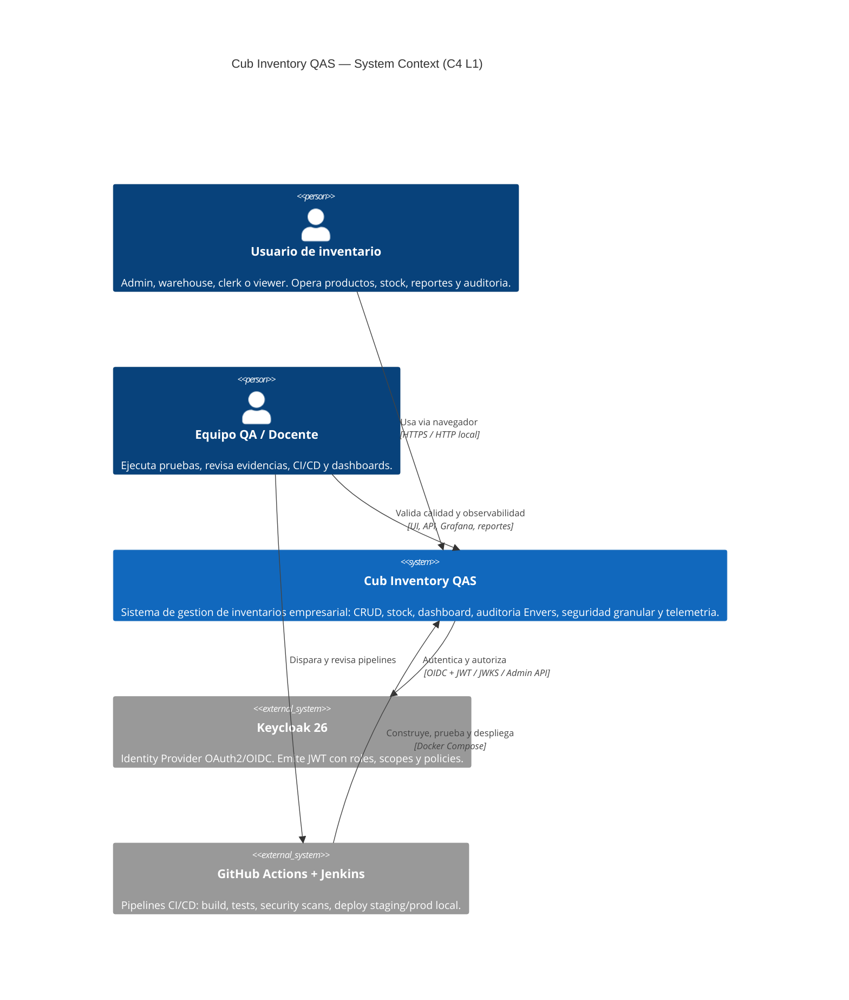
```mermaid
C4Context
title Cub Inventory QAS — System Context (C4 L1)

Person(user, "Usuario de inventario", "Admin, warehouse, clerk o viewer. Opera productos, stock, reportes y auditoria.")
Person(qa, "Equipo QA / Docente", "Ejecuta pruebas, revisa evidencias, CI/CD y dashboards.")

System(cub, "Cub Inventory QAS", "Sistema de gestion de inventarios empresarial: CRUD, stock, dashboard, auditoria Envers, seguridad granular y telemetria.")

System_Ext(idp, "Keycloak 26", "Identity Provider OAuth2/OIDC. Emite JWT con roles, scopes y policies.")
System_Ext(ci, "GitHub Actions + Jenkins", "Pipelines CI/CD: build, tests, security scans, deploy staging/prod local.")

Rel(user, cub, "Usa via navegador", "HTTPS / HTTP local")
Rel(qa, cub, "Valida calidad y observabilidad", "UI, API, Grafana, reportes")
Rel(qa, ci, "Dispara y revisa pipelines")
Rel(cub, idp, "Autentica y autoriza", "OIDC + JWT / JWKS / Admin API")
Rel(ci, cub, "Construye, prueba y despliega", "Docker Compose")
```

### Level 2 — Containers

Runtime containers inside Cub (Docker Compose: app + observability).

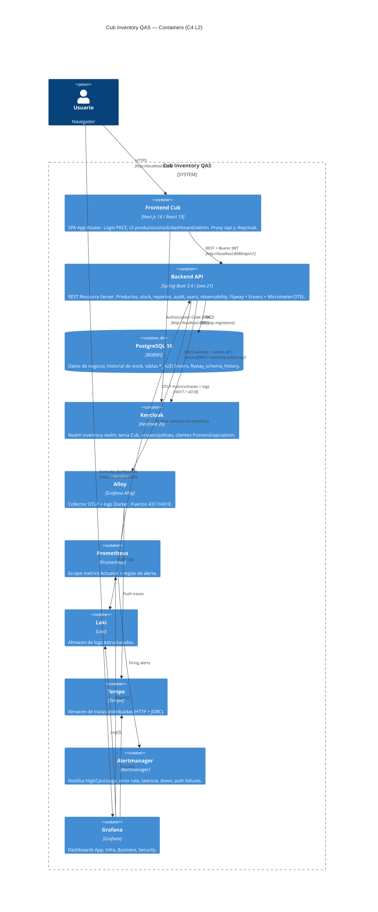
```mermaid
C4Container
title Cub Inventory QAS — Containers (C4 L2)

Person(user, "Usuario", "Navegador")

System_Boundary(cub, "Cub Inventory QAS") {
  Container(web, "Frontend Cub", "Next.js 16 / React 19", "SPA App Router. Login PKCE, UI productos/stock/dashboard/admin. Proxy /api y /keycloak.")
  Container(api, "Backend API", "Spring Boot 3.4 / Java 21", "REST Resource Server. Productos, stock, reportes, audit, users, observability. Flyway + Envers + Micrometer/OTEL.")
  ContainerDb(db, "PostgreSQL 16", "RDBMS", "Datos de negocio, historial de stock, tablas *_AUD Envers, flyway_schema_history.")
  Container(kc, "Keycloak", "Keycloak 26", "Realm inventory-realm, tema Cub, scopes/policies, clientes frontend/api/admin.")
  Container(alloy, "Alloy", "Grafana Alloy", "Collector OTLP + logs Docker. Puertos 4317/4318.")
  Container(prom, "Prometheus", "Prometheus", "Scrape metrics Actuator + reglas de alerta.")
  Container(loki, "Loki", "Loki", "Almacen de logs estructurados.")
  Container(tempo, "Tempo", "Tempo", "Almacen de trazas distribuidas (HTTP + JDBC).")
  Container(am, "Alertmanager", "Alertmanager", "Notifica HighCpuUsage, error rate, latencia, down, auth failures.")
  Container(graf, "Grafana", "Grafana", "Dashboards App, Infra, Business, Security.")
}

Rel(user, web, "HTTPS", "http://localhost:3000")
Rel(web, kc, "Authorization Code + PKCE", "http://localhost:8081")
Rel(web, api, "REST + Bearer JWT", "http://localhost:8080/api/v1")
Rel(api, db, "JDBC", "Flyway migrations")
Rel(api, kc, "JWKS validate + Admin API", "issuer/JWKS + inventory-admin-api")
Rel(api, alloy, "OTLP metrics/traces + logs", ":4317 / :4318")
Rel(alloy, loki, "Push logs")
Rel(alloy, tempo, "Push traces")
Rel(prom, api, "Scrape /actuator/prometheus")
Rel(prom, am, "Firing alerts")
Rel(graf, prom, "PromQL")
Rel(graf, loki, "LogQL")
Rel(graf, tempo, "TraceQL")
Rel(user, graf, "Consulta dashboards", "http://localhost:3030")
```

### Level 3 — Components (Backend API)

Internal structure of the Spring Boot container (modules that map to PDF capabilities).

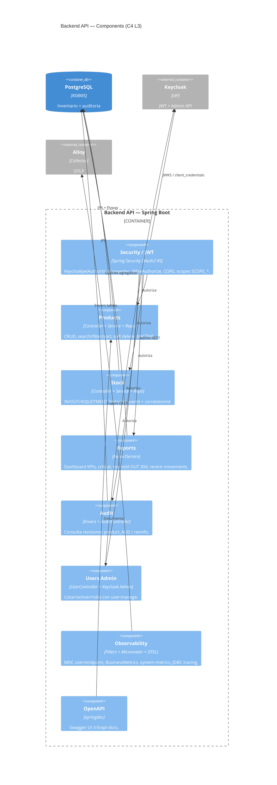
```mermaid
C4Component
title Backend API — Components (C4 L3)

Container_Boundary(api, "Backend API — Spring Boot") {
  Component(sec, "Security / JWT", "Spring Security OAuth2 RS", "KeycloakJwtAuthoritiesConverter, @PreAuthorize, CORS, scopes SCOPE_*.")
  Component(prod, "Products", "Controller + Service + Repo", "CRUD, search/filter/sort, soft delete INACTIVE.")
  Component(stock, "Stock", "Controller + Service + Repo", "IN/OUT/ADJUSTMENT, historial, userId + correlationId.")
  Component(report, "Reports", "ReportService", "Dashboard KPIs, critical, top sold OUT 30d, recent movements.")
  Component(audit, "Audit", "Envers + AuditController", "Consulta revisiones product_AUD / revinfo.")
  Component(users, "Users Admin", "UserController + Keycloak Admin", "Listar/activar/roles con user:manage.")
  Component(obs, "Observability", "Filters + Micrometer + OTEL", "MDC user/endpoint, BusinessMetrics, system-metrics, JDBC tracing.")
  Component(openapi, "OpenAPI", "springdoc", "Swagger UI /v3/api-docs.")
}

ContainerDb(db, "PostgreSQL", "RDBMS", "Inventario + auditoria")
Container_Ext(kc, "Keycloak", "IdP", "JWT + Admin API")
Container_Ext(alloy, "Alloy", "Collector", "OTLP")

Rel(sec, kc, "JWKS / client_credentials")
Rel(users, kc, "Admin REST")
Rel(prod, db, "JPA + Flyway")
Rel(stock, db, "JPA")
Rel(report, db, "Queries agregadas")
Rel(audit, db, "Envers tables")
Rel(obs, alloy, "Export OTLP")
Rel(sec, prod, "Autoriza")
Rel(sec, stock, "Autoriza")
Rel(sec, report, "Autoriza")
Rel(sec, audit, "Autoriza")
Rel(sec, users, "Autoriza")
Rel(openapi, prod, "Documenta")
```

### Level 3 — Components (Frontend Cub)

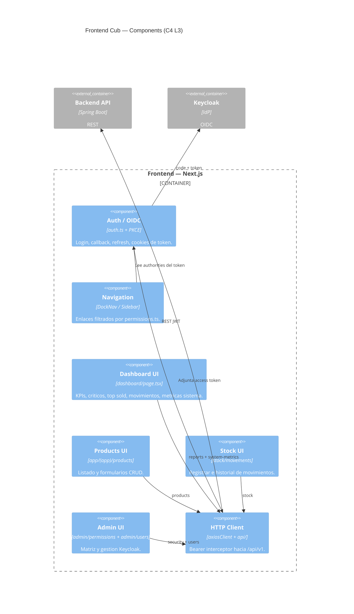
```mermaid
C4Component
title Frontend Cub — Components (C4 L3)

Container_Boundary(web, "Frontend — Next.js") {
  Component(auth, "Auth / OIDC", "auth.ts + PKCE", "Login, callback, refresh, cookies de token.")
  Component(nav, "Navigation", "DockNav / Sidebar", "Enlaces filtrados por permissions.ts.")
  Component(dash, "Dashboard UI", "dashboard/page.tsx", "KPIs, criticos, top sold, movimientos, metricas sistema.")
  Component(prodUi, "Products UI", "app/(app)/products", "Listado y formularios CRUD.")
  Component(stockUi, "Stock UI", "stock/movements", "Registrar e historial de movimientos.")
  Component(adminUi, "Admin UI", "admin/permissions + admin/users", "Matriz y gestion Keycloak.")
  Component(http, "HTTP Client", "axiosClient + api/", "Bearer interceptor hacia /api/v1.")
}

Container_Ext(api, "Backend API", "Spring Boot", "REST")
Container_Ext(kc, "Keycloak", "IdP", "OIDC")

Rel(auth, kc, "code + token")
Rel(http, api, "REST JWT")
Rel(auth, http, "Adjunta access token")
Rel(dash, http, "reports + system-metrics")
Rel(prodUi, http, "products")
Rel(stockUi, http, "stock")
Rel(adminUi, http, "security + users")
Rel(nav, auth, "Lee authorities del token")
```

### Level 2 (CI/CD & QA) — Supporting systems

Not runtime of the business app, but required by the PDF DevSecOps model.

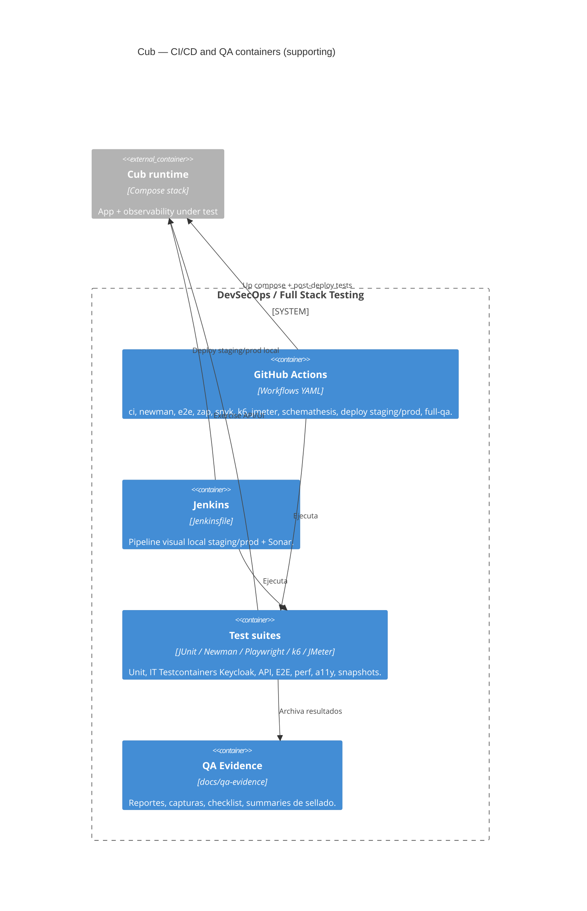
```mermaid
C4Container
title Cub — CI/CD and QA containers (supporting)

System_Boundary(devops, "DevSecOps / Full Stack Testing") {
  Container(gha, "GitHub Actions", "Workflows YAML", "ci, newman, e2e, zap, snyk, k6, jmeter, schemathesis, deploy staging/prod, full-qa.")
  Container(jenkins, "Jenkins", "Jenkinsfile", "Pipeline visual local staging/prod + Sonar.")
  Container(tests, "Test suites", "JUnit / Newman / Playwright / k6 / JMeter", "Unit, IT Testcontainers Keycloak, API, E2E, perf, a11y, snapshots.")
  Container(evidence, "QA Evidence", "docs/qa-evidence", "Reportes, capturas, checklist, summaries de sellado.")
}

Container_Ext(cubRuntime, "Cub runtime", "Compose stack", "App + observability under test")

Rel(gha, cubRuntime, "Up compose + post-deploy tests")
Rel(jenkins, cubRuntime, "Deploy staging/prod local")
Rel(tests, cubRuntime, "Exercise API/UI")
Rel(gha, tests, "Ejecuta")
Rel(jenkins, tests, "Ejecuta")
Rel(tests, evidence, "Archiva resultados")
```

## Authentication Flow

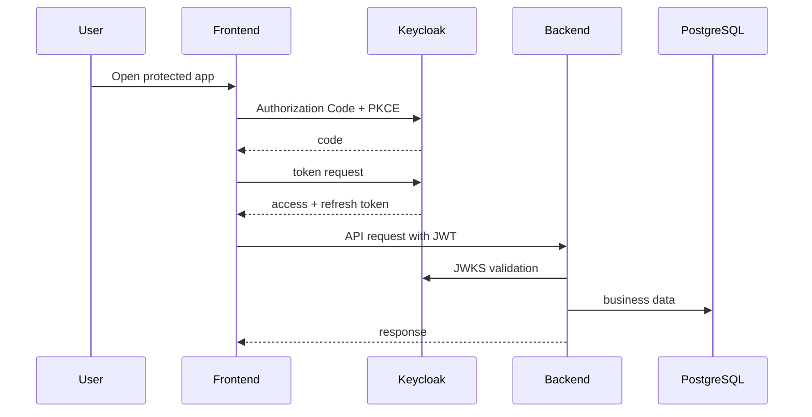
```mermaid
sequenceDiagram
  participant U as User
  participant F as Frontend
  participant K as Keycloak
  participant B as Backend
  participant DB as PostgreSQL
  U->>F: Open protected app
  F->>K: Authorization Code + PKCE
  K-->>F: code
  F->>K: token request
  K-->>F: access + refresh token
  F->>B: API request with JWT
  B->>K: JWKS validation
  B->>DB: business data
  B-->>F: response
```

## Authorization: Scopes + Policies

Keycloak exports seven business scopes:

`product:view`, `product:manage`, `stock:view`, `stock:manage`, `report:view`, `user:manage`, `audit:view`.

`inventory-api` has Authorization Services enabled with resources for Products, Stock, Reports, Users and Audit. Role policies map `inventory-admin`, `warehouse-manager`, `inventory-clerk` and `inventory-viewer` to allowed scopes.

Spring Resource Server remains the enforcement point for API requests. `KeycloakJwtAuthoritiesConverter` reads:

- realm roles, expanded through local role-to-permission mapping
- `resource_access.inventory-api.roles`
- `scope` claim as string or array

When role claims are present, scope aliases are added only for permissions already backed by roles. This prevents optional requested scopes from over-granting lower-privilege users while still exposing `SCOPE_product:view` style evidence.

```mermaid
flowchart LR
  Token[Keycloak JWT] --> Converter[JWT authorities converter]
  Converter --> Roles[realm/resource roles]
  Converter --> Scopes[scope claim]
  Roles --> Authorities[product:view and SCOPE_product:view]
  Scopes --> Authorities
  Authorities --> PreAuth[@PreAuthorize]
```

## User Management Flow

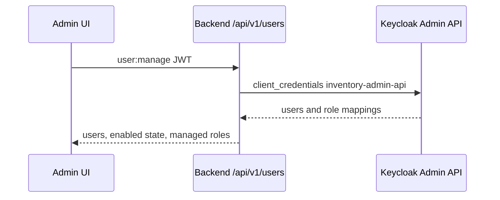
```mermaid
sequenceDiagram
  participant A as Admin UI
  participant B as Backend /api/v1/users
  participant K as Keycloak Admin API
  A->>B: user:manage JWT
  B->>K: client_credentials inventory-admin-api
  K-->>B: users and role mappings
  B-->>A: users, enabled state, managed roles
```

## Stock Movement Flow

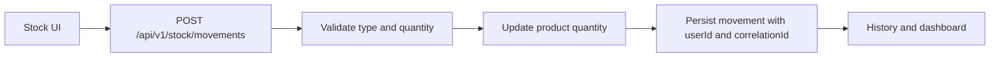
```mermaid
flowchart LR
  UI[Stock UI] --> API[POST /api/v1/stock/movements]
  API --> Rules[Validate type and quantity]
  Rules --> Product[Update product quantity]
  Product --> Movement[Persist movement with userId and correlationId]
  Movement --> History[History and dashboard]
```

## Envers Audit Flow

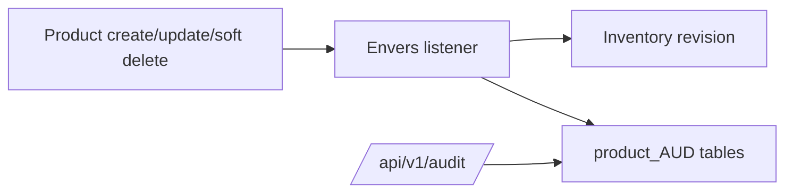
```mermaid
flowchart LR
  ProductChange[Product create/update/soft delete] --> Envers[Envers listener]
  Envers --> REVINFO[Inventory revision]
  Envers --> ProductAUD[product_AUD tables]
  AuditAPI[/api/v1/audit/] --> ProductAUD
```

## Observability Flow

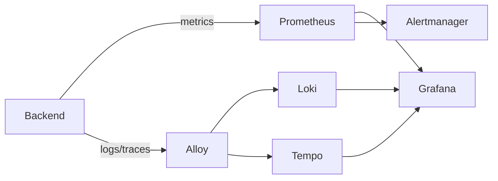
```mermaid
flowchart LR
  Backend -->|metrics| Prometheus
  Backend -->|logs/traces| Alloy
  Alloy --> Loki
  Alloy --> Tempo
  Prometheus --> Grafana
  Loki --> Grafana
  Tempo --> Grafana
  Prometheus --> Alertmanager
```

## CI/CD Flow

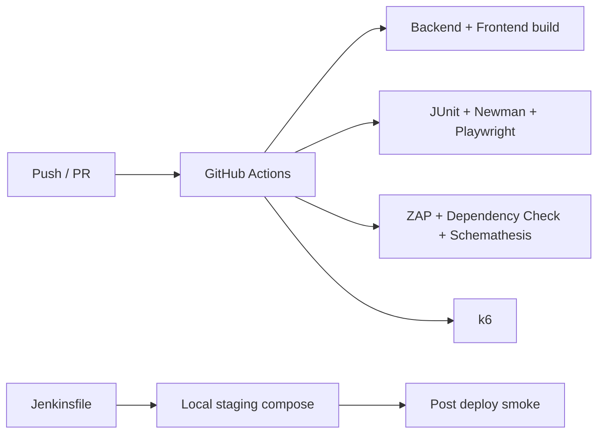
```mermaid
flowchart LR
  Push[Push / PR] --> GHA[GitHub Actions]
  GHA --> Build[Backend + Frontend build]
  GHA --> Tests[JUnit + Newman + Playwright]
  GHA --> Security[ZAP + Dependency Check + Schemathesis]
  GHA --> Perf[k6]
  Jenkins[Jenkinsfile] --> Staging[Local staging compose]
  Staging --> Smoke[Post deploy smoke]
```

## Services and Ports

| Service | Port | Notes |
|---|---:|---|
| Frontend | 3000 | Next.js app |
| Backend | 8080 | API, Swagger, Actuator |
| Keycloak | 8081 | Public IdP URL |
| PostgreSQL | 5432 | Dev only exposed |
| Grafana | 3030 | Dashboards |
| Prometheus | 9090 | Metrics |
| Loki | 3100 | Logs |
| Tempo | 3200 | Traces |
| Alertmanager | 9093 | Alerts |

## Main Environment Variables

`DATABASE_URL`, `DATABASE_USERNAME`, `DATABASE_PASSWORD`, `KEYCLOAK_ISSUER_URI`, `KEYCLOAK_JWKS_URI`, `NEXT_PUBLIC_KEYCLOAK_URL`, `NEXT_PUBLIC_APP_URL`, `INVENTORY_CORS_ORIGINS`, `OTEL_EXPORTER_OTLP_*`.

## Decisions

| ADR | Decision |
|---|---|
| ADR-01 | Spring Boot + PostgreSQL for transactional inventory |
| ADR-02 | Keycloak + PKCE for enterprise auth |
| ADR-03 | Authorization by effective authority from roles and scopes |
| ADR-04 | Soft delete + Envers for traceability |
| ADR-05 | Testcontainers for integration database tests |
| ADR-06 | OpenTelemetry stack for metrics, logs and traces |
| ADR-07 | Docker Compose for dev, staging and local production |

## Known Limitations

Local production is demonstrable, not cloud-hardened. PostgreSQL exporter is not included, so database infrastructure alerts are documented as a limitation. k6, JMeter, Snyk and security scans can be heavy and may run manually in CI.

## Basic Maintenance

Run Flyway validation after migrations, keep Keycloak realm export versioned, update `.env.example` for new variables, and archive QA evidence under `docs/qa-evidence/`.
