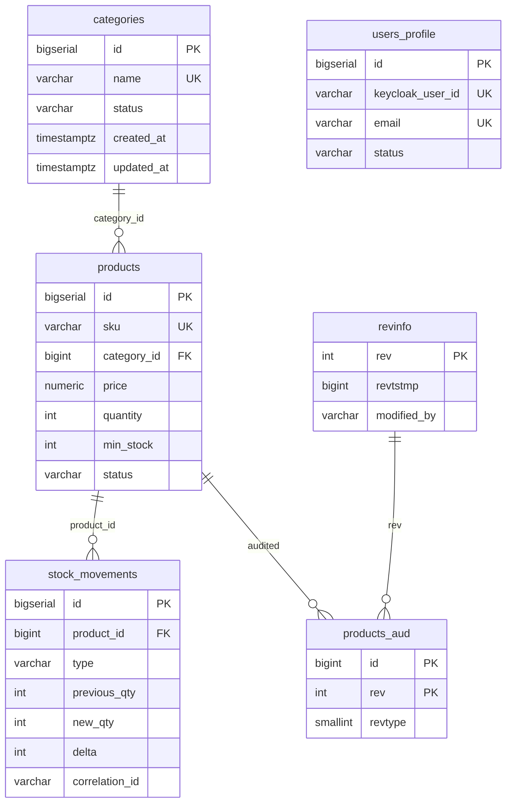

# Modelo de datos — dominio inventario

Ticket: **QA-17** — Migraciones Flyway V1–V7.  
Fuente de verdad: scripts en `backend/src/main/resources/db/migration/`.

## Diagrama entidad-relación



## Tablas operativas

### `categories` (V1)

| Columna | Tipo | Reglas |
|---------|------|--------|
| id | BIGSERIAL | PK |
| name | VARCHAR(100) | NOT NULL, UNIQUE |
| description | VARCHAR(500) | |
| status | VARCHAR(20) | `ACTIVE` \| `INACTIVE` |
| created_at, updated_at | TIMESTAMPTZ | NOT NULL |

### `products` (V2)

| Columna | Tipo | Reglas |
|---------|------|--------|
| id | BIGSERIAL | PK |
| sku | VARCHAR(50) | NOT NULL, UNIQUE |
| category_id | BIGINT | FK → categories |
| price | NUMERIC(12,2) | ≥ 0 |
| quantity, min_stock | INTEGER | ≥ 0 |
| status | VARCHAR(20) | `ACTIVE` \| `INACTIVE` |

**Stock crítico:** `quantity <= min_stock` (índice parcial en V7).

### `stock_movements` (V3)

| Columna | Tipo | Reglas |
|---------|------|--------|
| type | VARCHAR(20) | `IN` \| `OUT` \| `ADJUSTMENT` |
| previous_qty, new_qty | INTEGER | ≥ 0 |
| delta | INTEGER | Debe cumplir `delta = new_qty - previous_qty` |
| user_id | VARCHAR(100) | Usuario Keycloak o sistema |
| correlation_id | VARCHAR(64) | Trazabilidad observabilidad |

### `users_profile` (V4)

Perfil local complementario a Keycloak (no sustituye IAM).

| Columna | Tipo | Reglas |
|---------|------|--------|
| keycloak_user_id | VARCHAR(100) | UNIQUE |
| email | VARCHAR(255) | UNIQUE |

## Auditoría Envers (V5)

| Objeto | Uso |
|--------|-----|
| `revinfo_seq` | Secuencia allocationSize 50 (Hibernate Envers) |
| `revinfo` | Revisión: `rev`, `revtstmp`, `modified_by` |
| `products_aud` | Snapshot histórico de `products` |

Entidad JPA esperada: `InventoryRevisionEntity` → tabla `revinfo`; `Product` con `@Audited`.

## Seed (V6)

- 3 categorías, 4 productos demo, 4 movimientos IN iniciales.
- SKU de ejemplo: `SKU-MOUSE-001`, `SKU-HUB-002`, etc.

## Índices (V7)

Índices B-tree en FKs, filtros (`status`, `sku`, `email`) e índice parcial `idx_products_critical` para reportes de stock bajo mínimo.

## Orden Flyway

```
V1 → V2 → V3 → V4 → V5 → V6 → V7
```

No existe **V8** en este plan: la auditoría Envers vive en **V5**.

## Trazabilidad requisitos

| Requisito | Migración |
|-----------|-----------|
| RF-01, RF-02 | V1, V2 |
| RF-04 | V3 |
| RF-10 | V5 |
| RNF-02 | V1–V7 versionadas |

Ver [`requirements.md`](requirements.md).
